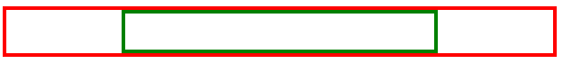
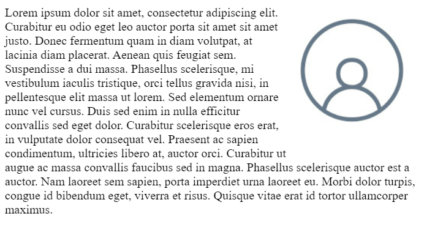

# Simple HTML tags

## Headings

Headings allow you to display titles and subtitles on your webpage.

```html
<body>
    <h1>Heading 1</h1>
    <h2>Heading 2</h2>
    <h3>Heading 3</h3>
    <h4>Heading 4</h4>
    <h5>Heading 5</h5>
    <h6>Heading 6</h6>
</body>
```

The following displays in the web browser:


## Paragraphs

Paragraphs contain text content.

```html
<p>
   This paragraph
   contains a lot of lines
   but they are ignored.
</p>
```

The following displays in the web browser: 


__Note__ that putting content on a new line is ignored by the web browser.

## Line Breaks

As you've learned, line breaks in the paragraph tag line are ignored by HTML. Instead, they must be specified using the `<br>` tag. The `<br>` tag does not need a closing tag.

```html
<p>
   This paragraph<br>
   contains a lot of lines<br>
   and they are displayed.
</p>
```

The following displays in the web browser:


## Strong

Strong tags can be used to indicate that a range of text has importance.

```html
<p>
   No matter how much the dog barks: <strong>don't feed him chocolate</strong>.
</p>
```

The following displays in the web browser: 


## Bold

Bold tags can be used to draw the reader's attention to a range of text.

```html
<p>
   The primary colors are <b>red</b>, <b>yellow</b> and <b>blue</b>.
</p>
```

The following displays in the web browser: 


The following displays in the web browser: 


Bold tags should be used to draw attention but not to indicate that something is more important. Consider the following example:

```html
The three core technologies of the Internet are <b>HTML</b>, <b>CSS</b> and <b>Javascript</b>.
```

The following displays in the web browser: 


## Emphasis

Emphasis tags can be used to add emphasis to text.

```html
<p>
   Wake up <em>now</em>!
</p>
```

The following displays in the web browser: 


## Italics

Italics tags can be used to offset a range of text.

```html
<p>
   The term <i>HTML</i> stands for HyperText Markup Language.
</p>
```

The following displays in the web browser: 


## Emphasis vs. Italics

By default both tags will have the same visual effect in the web browser. The only difference is the meaning.

Emphasis tags stress the text contained in them. Let's explore the following example:

```html
I <em>really</em> want ice cream.
```

The following displays in the web browser: 


Italics represent off-set text and should be used for technical terms, titles, a thought or a phrase from another language, for example:

```html
My favourite book is <i>Dracula</i>.
```

The following displays in the web browser: 


Screen readers will not announce any difference if an _italics_ tag is used.

## Lists

You can add lists to your web pages. There are two types of lists in HTML.

Lists can be unordered using the `<ul>` tag. List items are specified using the `<li>` tag, for example:

```html
<ul>
    <li>Tea</li>
    <li>Sugar</li>
    <li>Milk</li>
</ul>
```

This displays in the web browser as:


Lists can also be ordered using the `<ol>` tag. Again, list items are specified using the `<li>` tag.

```html
<ol>
    <li>Rocky</li>
    <li>Rocky II</li>
    <li>Rocky III</li>
</ol>
```

This displays as the following in the web browser.


## Div tags

A `<div>` tag defines a content division in a HTML document. It acts as a generic container and has no effect on the content unless it is styled by CSS.

The following example shows a `<div>` element that contains a paragraph element:

```html
<div>
    <p>This is a paragraph inside a div</p>
</div>
```

This displays as the following in the web browser.


It can be nested inside other elements, for example:

```html
<div>
    <div>
        <p>This is a paragraph inside a div that’s inside another div</p>
    </div>
</div>
```

This displays in the web browser as:


As mentioned, the div has no impact on content unless it is styled by CSS. Let’s add a small CSS rule that styles all divs on the page.

Don't worry about the meaning of the CSS just yet, you'll explore CSS further in a later lesson. In summary, you're applying a rule that adds a border and some visual spacing to the element.

```html
<style>
    div {
        border: 1px solid black;
        padding: 2px;
    }
</style>
<div>
    <div>
        <p>This is a paragraph inside stylized divs</p>
    </div>
</div>
```

This displays in the web browser as:


Div elements are an important part of building webpages. More advanced usage of div elements will be explored in another course.

## Comments

If you want to leave a comment in the code for other developers, it can be added as:

```html
<!-- This is a comment -->
```

The comment will not be displayed in the web browser.


# Different types of selectors

## Element Selectors

The element selector allows developers to select HTML elements based on their element type.

For example, if you use `p` as the selector, the rule will apply to all `p` elements on the webpage.

_HTML_

```html
<p>Once upon a time...</p>
<p>In a hidden land...</p>
```

_CSS_

```css
p { 
    color: blue; 
}​
```

## ID Selectors

The ID selector uses the id attribute of an HTML element. Since the id is unique within a webpage, it allows the developer to select a specific element for styling. ID selectors are prefixed with a # character.

_HTML_

```html
​<span id="latest">New!</span>
```

_CSS_

```css
#latest { 
    background-color: purple; 
}​​
```

## Class Selectors

Elements can also be selected based on the class attribute applied to them. The CSS rule has been applied to all elements with the specified class name. The class selector is prefixed with a `.` character.

In the following example, the CSS rule applies to both elements as they have the `navigation` CSS class applied to them.

_HTML_

```html
​<a class="navigation">Go Back</a>
​<p class="navigation">Go Forward</p>
```

_CSS_

```css
.navigation { 
    margin: 2px;
}​​
```

## Element with Class Selector

A more specific method for selecting HTML elements is by first selecting the HTML element, then selecting the CSS class or ID.

The example below selects all `p` elements that have the CSS class `introduction` applied to them.

_HTML_

```html
<p class="introduction"></a>
```

_CSS_

```css
p.introduction { 
    margin: 2px;
}​​
```

## Descendant Selectors

Descendant selectors are useful if you need to select HTML elements that are contained within another selector.

Let's explore an example.

You have the following HTML structure and CSS rule.

_HTML_

```html
<div id="blog">
    <h1>Latest News</h1>
    <div>
        <h1>Today's Weather</h1>
        <p>The weather will be sunny</p>
    </div>
    <p>Subscribe for more news</p>
</div>
<div>
    <h1>Archives</h1>
</div>
```

_CSS_

```css
#blog h1​ {
    color: blue;
}
```

The CSS rule will select all `h1` elements that are contained within the element with the ID `blog`. The CSS rule will not apply to the h1 element containing the text `Archives`.

The structure of a descendant selector is a CSS selector, followed by a single space character, followed by another CSS selector.

Multiple descendants can also be selected. For example, to select all `h1` elements that are descendants of div elements which are descendants of the `blog` element, the selector is specified as follows.

_CSS_

```css
#blog div h1​ {
    color: blue;
}
```

## Child Selectors

Child selectors are more specific than descendant selectors. They only select elements that are immediate descendants (children) of a selector (the parent).

For example, you have the following HTML structure:

_HTML_

```html
<div id="blog">
    <h1>Latest News</h1>
    <div>
        <h1>Today's Weather</h1>
        <p>The weather will be sunny</p>
    </div>
    <p>Subscribe for more news</p>
</div>
```

If you wanted to style the `h1` element containing the text `Latest News`, you can use the following child selector:

_CSS_

```css
#blog > h1​ {
    color: blue;
}
```

This will select the element with the ID `blog` (the parent), then it will select all `h1` elements that are contained directly in that element (the children). The structure of the child selector is a CSS selector followed by the child combinator symbol > followed by another CSS selector.

__Note__ that this will not go beyond a single depth level. Therefore, the CSS rule will __not__ be applied to the `h1` element containing the text `Today's Weather`.

## hover Pseudo-Class

A special keyword called a pseudo-class allows developers to select elements based on their state. Don't worry too much about what that means right now. For now, let's look at how the hover pseudo-class allows you to style an element when the mouse cursor hovers over the element.

The simplest example of this is changing the color of a hyperlink when it is hovered over. To do this, you add the `:hover` pseudo-class to the end of the selector. In the following example, adding `:hover` to the `a` element will change the color of the hyperlink to orange when it is hovered over.

_CSS_

```css
a:hover {
    color: orange;
}
```

This pseudo-class is very useful for creating visual effects based on user interaction.

## Other Selectors

There are many other CSS selectors available to style your webpage.


# Alignment basics

## Text Alignment

Aligning text within an HTML element is very simple. To do this, you use the `text-align` CSS property. In the following example, the CSS rule is setting the text of all paragraph elements to be center aligned.

```css
p {
    text-align: center;
}
```

Text alignment can be set to `left`, `right`, `center` and `justify`.

The `justify` alignment spreads the text out so that every line of the text has the same width.

The default alignment is `left` for languages that are left-to-right such as English. For right-to-left languages such as Arabic, the default alignment is `right`.

## HTML Element Alignment

HTML element alignment is more complicated than text alignment. To align HTML elements, you must consider the box model and document flow from previous lessons. Aligning an HTML element is done by changing the properties of its box model and how it impacts the document flow.

## HTML Element Center Alignment

To center align an element, you set a width on the element and push its margins out to fill the remaining available space of the parent element as in the following HTML structure:

```html
<div class="parent">
    <div class="child">
    </div>
</div>
```

In your CSS, you'll set the `parent` element to have a red border to visualize the space it occupies:

```css
.parent {
    border: 4px solid red;
}
```

The `child` element will have a width equal to 50% of the `parent` element with a padding of 20 pixels. Note that `padding: 20px` is shorthand for setting the padding top, bottom, left and right to `20px`. To visualize the space it occupies, set the border to green:

```css
.child {
    width: 50%;
    padding: 20px;
    border: 4px solid green;
}
```

To align the element to the center, set its `margin` property to `auto`. The `auto` will tell the browser to calculate the margin automatically based on the space available.

```css
.child {
    width: 50%;
    padding: 20px;
    border: 4px solid green;
    margin: auto;
}
```

The result is the `child` element is centered within the `parent` element:



It is important to note that this works because the `div` element is a block-level element.  

If you want to align an inline element like `img`, you will need to change it to a block-level element. Similar to the `div` example, you add the `img` to a parent element:

```html
<div class="parent">
    
</div>
```

The CSS rule then changes the `img` element to a block-level element and sets its margin to `auto`:

```css
.child {
    display: block;
    width: 50%;
    margin: auto;
}
```

To be more precise, in CSS you can set only the left and right margins to auto. This allows you to set the top and bottom margins to specific values if needed.

```css
.child {
    display: block;
    width: 50%;
    margin-left: auto;
    margin-right: auto;
}
```

## HTML Element Left / Right Alignment

The two most common ways to left and right align elements are to use the `float` property and the `position` property.

The `position` property has several value options that impact how the element displays in the document flow. You'll explore how to use the `position` property later on. For now, let's focus on the `float` property.

The `float` property sets an element's position relative to the text content within a parent element. Text will wrap around the element.

In the following example, the image will be aligned to the right of the `div` element. The text content will wrap around the image:

_HTML_

```html
<div class="parent">
     Lorem ipsum dolor sit amet, consectetur adipiscing elit. Curabitur eu odio eget leo auctor porta sit amet sit amet justo. Donec fermentum quam in diam volutpat, at lacinia diam placerat. Aenean quis feugiat sem. Suspendisse a dui massa. Phasellus scelerisque, mi vestibulum iaculis tristique, orci tellus gravida nisi, in pellentesque elit massa ut lorem. Sed elementum ornare nunc vel cursus. Duis sed enim in nulla efficitur convallis sed eget dolor. Curabitur scelerisque eros erat, in vulputate dolor consequat vel. Praesent ac sapien condimentum, ultricies libero at, auctor orci. Curabitur ut augue ac massa convallis faucibus sed in magna. Phasellus scelerisque auctor est a auctor. Nam laoreet sem sapien, porta imperdiet urna laoreet eu. Morbi dolor turpis, congue id bibendum eget, viverra et risus. Quisque vitae erat id tortor ullamcorper maximus.
</div>
```

_CSS_

```css
.child {
    float: right;
}
```

The following displays in the web browser:  




# Additional Resources: Introduction to HTML and CSS

## Getting started with HTML

- [HTML Elements Reference](https://developer.mozilla.org/en-US/docs/Web/HTML/Element)
- [The Form Element](https://developer.mozilla.org/en-US/docs/Web/HTML/Element/form)
- [What is the Document Object Model?](https://www.w3.org/TR/WD-DOM/introduction.html)
- [ARIA in HTML](https://w3c.github.io/html-aria/)
- [ARIA Authoring Practices](https://www.w3.org/TR/wai-aria-practices-1.2/)

## CSS Basics

- [CSS Reference](https://developer.mozilla.org/en-US/docs/Web/CSS/Reference)
- [HTML and CSS: Design and build websites](https://www.amazon.com/HTML-CSS-Design-Build-Websites/dp/1118008189/)
- [CSS Definitive Guide](https://www.amazon.com/CSS-Definitive-Guide-Visual-Presentation/dp/1449393195/)