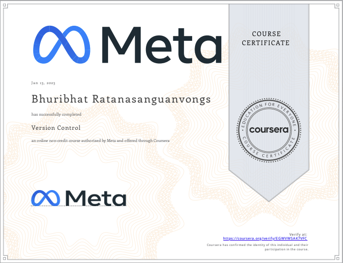

# Version Control

 

    

 

Course Link: [Version Control](https://www.coursera.org/learn/introduction-to-version-control?specialization=meta-front-end-developer)

## About this Course

In this module, you will learn about how modern software developers collaborate across the world without messing up each other's code. This involves using version control or subversion to bring order to the chaos of massive software projects that have the potential for mistakes and bugs. You will look at the different version control systems and how to create an effective software development workflow.

## Table of Content

- Week 1: [Software collaboration]()
- Week 2: [Command Line]()
- Week 3: [Working with Git]()
- Week 4: [Graded Assessment]()

# 🏆 Certificates 
To verify the certificates, click the images to follow the links.

  