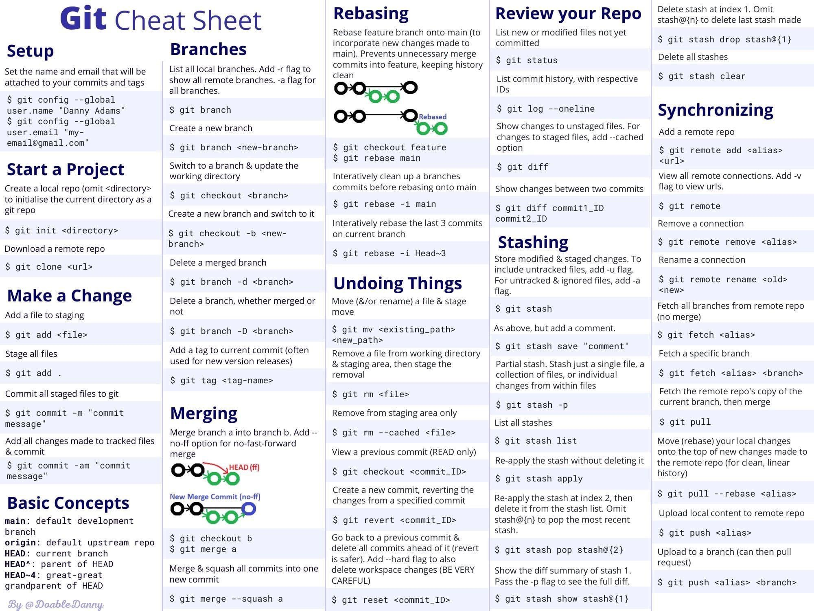

# Knowledge Check: Git and GitHub

1. In git, the repository on your device is known as a Remote.
   - True
   - False
   ```
   Answer: False
   Explanation: Remotes are repositories on other devices such as servers. The repository on your device is known as the Local.
   ```

2. In git, what is the operation used to initially download a repository?
   - push
   - pull
   - clone
   ```
   Answer: clone
   Explanation: The git clone operation is used to download a repository.
   ```

3. The staged area is used to prepare all your files and changes for committing.
   - True
   - False
   ```
   Answer: True
   Explanation: Files and changes are added to the staged area using the git add command.
   ```

4. Once a file is committed using the git commit operation, it is available on all remote repositories.
   - True
   - False
   ```
   Answer: False
   Explanation: The file is only committed to your local repository. It must be pushed to remote repositories after committing.
   ```

5. What of the following commands allow you to inspect your current changes before committing?
   - git add
   - git diff
   - git log
   ```
   Answer: git diff
   Explanation: git diff is used to inspect changes.
   ```

6. Forking allows you to contribute to another person or organisation’s repository by creating your own copy of the repository.
   - True
   - False
   ```
   Answer: True
   Explanation: Forking is a common practice in open-source projects allowing for contributions from different developers.
   ```


